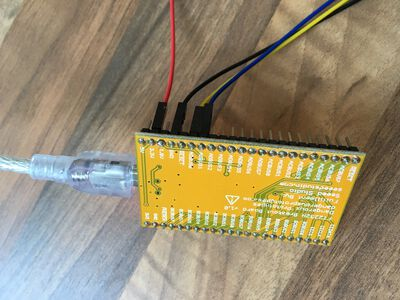
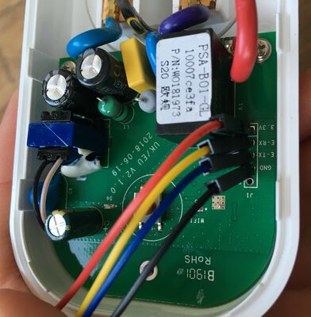

## Flash

Clone this repository, `cd` into it. Connect wires to the Sonoff S20 (I've been using a [FT2232 breakout board](http://dangerousprototypes.com/docs/FT2232_breakout_board)). Flash using [PlatformIO CLI](https://docs.platformio.org/en/latest/installation.html).  

Run

    platformio run

first to see if everything compiles, first.

To get the Sonoff into programming mode, connect every pin, except 3.3V. Press the button on the PCB and then plug in the 3.3V, hold it for further ≈4s:

In case you have multiple USB-Serial adapters, or your adapter offers multiple ports:

    platformio device list
    platformio run --upload-port /dev/cu.usbserial-00202102A 

For WiFi OTA upload:

    platformio device list --mdns
    platformio run -t upload --upload-port <SonoffS20_1234567.local or IP address>

### Serial Monitor

Debug with:

    platformio device monitor

or

    platformio device monitor --port /dev/cu.usbserial-00202102A

### Debugging build

Flash on Wemos D1 Mini board for better debugging:

    platformio run -e d1_mini

I recommend to flash debugging firmwares via OTA as well, since it's much faster. You can still connect USB-Serial adapter for debugging monitor output simultaneously.

[settings_arduino]: https://github.com/arendst/Tasmota/wiki/Arduino-IDE
[settings_platformio]: https://docs.platformio.org/en/stable/boards/espressif8266/sonoff_s20.html
[settings_platformio_raw]: https://github.com/platformio/platform-espressif8266/blob/master/boards/sonoff_s20.json
[pinout]: https://esphome.io/devices/sonoff_s20.html